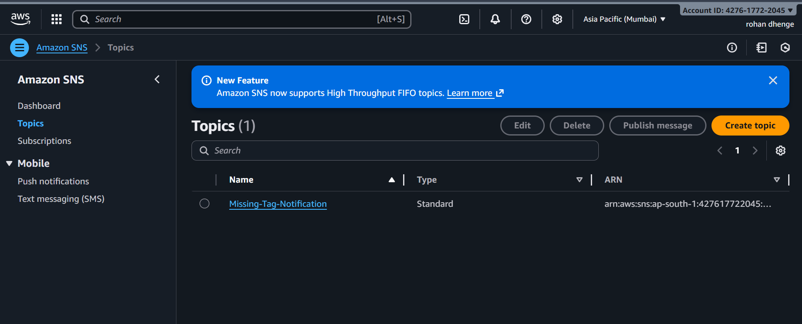
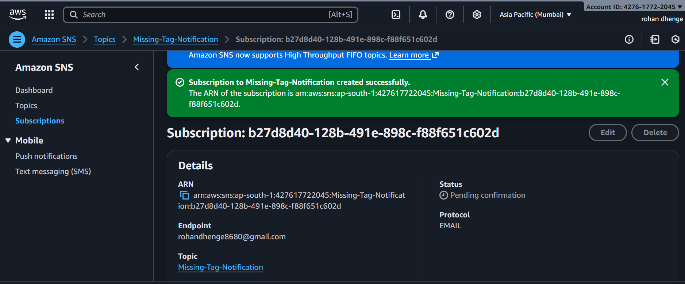
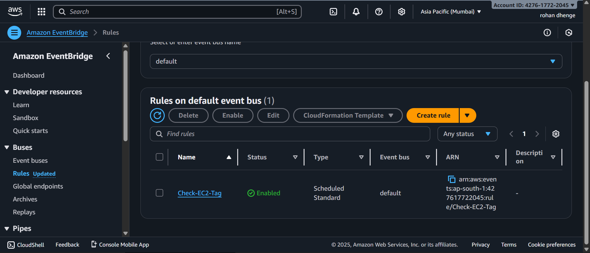
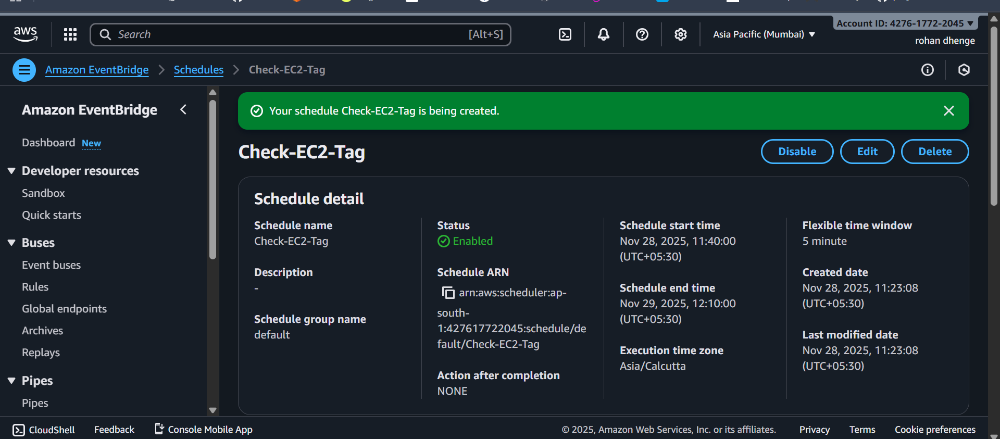
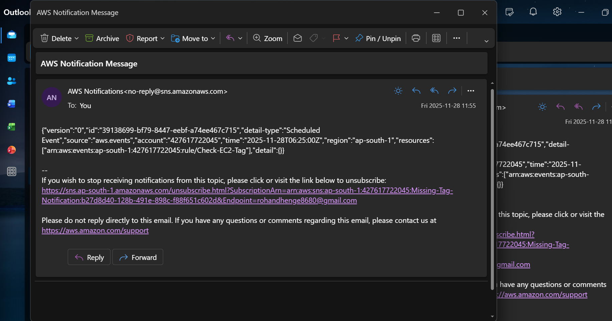

## EC2 Tag Notification
# Automated notifications when EC2 Instances are missing a specific tag

* To achieve automated notifications when EC2 instances are missing a specific tag (like the Environment tag), you can leverage a combination of AWS services such as AWS Lambda, AWS CloudWatch, and Amazon SNS. Here's a step-by-step guide for implementing this solution:

# Solution Overview
CloudWatch Events (EventBridge): Will trigger periodically to check for EC2 instances.
Lambda Function: Will be invoked by the event to check for instances that do not have the required tag or its value is missing.
SNS Topic: Sends an email notification when such instances are found.
Screenshot 2024-10-12 at 10 51 14 AM

# Steps
1.Create an SNS Topic for Email Notifications 

2.Go to the Amazon SNS Console and create a topic (e.g., MissingTagNotifications).

3.Choose the topic type as Standard.

4.Give it a name and create the topic.

5.Create a subscription to this SNS topic with your email address, and confirm the subscription via the email you receive.

6.Create a Lambda Function to Check EC2 Instances.

7.Go to the AWS Lambda Console and create a new Lambda function.

8.Choose "Author from scratch," give it a name and use a Python runtime.

9.Attach the necessary permissions to the Lambda function:

10.EC2 DescribeInstances permission to read instance tags.

11.SNS Publish permission to send notifications.

* Python code for the Lambda function

Configure Lambda Environment Variables
After creating the Lambda function, set the following environment variable:
SNS_TOPIC_ARN: Set this to the ARN of the SNS topic created earlier.

Create a CloudWatch Rule (EventBridge)
Go to the CloudWatch Console and create a rule.

Select Event Source as EventBridge and choose a schedule (e.g., every five minutes).

To run the EventBridge rule every 5 minutes, you can use the following cron expression:
cron(0/5 * * * ? *)

Set the target as the Lambda function you created.

Test the Solution You can either manually run the Lambda function from the console to verify that it is checking for instances without the tag or wait for the CloudWatch rule to trigger the Lambda function based on your schedule. If any instances are missing the required Environment tag or its value, you will receive an email notification listing the instance IDs.

## Final Output

 # Learn From This

-Setting up an AWS Lambda function to check EC2 instances for missing tags.

-Scheduling automatic checks using AWS EventBridge with a cron expression.

-Configuring Amazon SNS to send email notifications.

-Ensuring proper tagging for better cost and resource management in AWS.

-Stay tuned for this hands-on tutorial and simplify your AWS management!

#AWS #CloudAutomation #EC2Monitoring #LambdaFunction #EventBridge #TagCompliance #CloudWatch #DevOps #CloudComputing #CloudInfrastructure